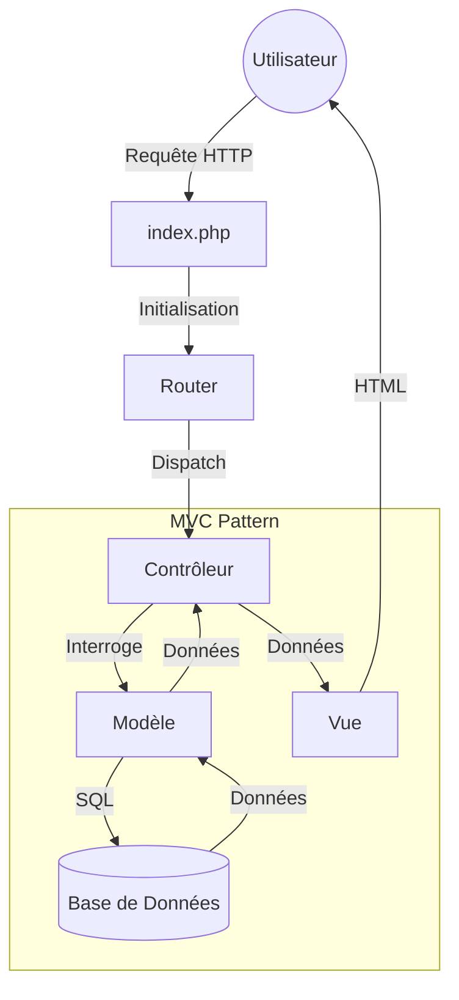

# Projet Web

## Installation

Suivez ces étapes pour installer et lancer le projet localement.

### Prérequis

- PHP 8.0 ou supérieur
- Composer
- MySQL ou MariaDB

### Étapes d'installation

1.  **Installer les dépendances**
    ```bash
    composer install
    ```

2.  **Configuration de l'environnement**
    Copiez le fichier d'exemple `.env.example` vers `.env` et configurez vos accès à la base de données.
    ```bash
    cp .env.example .env
    ```
    Ouvrez le fichier `.env` et modifiez les variables `DB_HOST`, `DB_NAME`, `DB_USER`, et `DB_PASS`.

3.  **Exécuter les migrations**
    Initialisez la base de données en exécutant le script de migration.
    ```bash
    php migrate.php
    ```

4.  **Lancer le serveur**
    Vous pouvez utiliser le serveur interne de PHP pour le développement.
    ```bash
    php -S localhost:8000
    ```
    Accédez ensuite à `http://localhost:8000` dans votre navigateur.

## Architecture

Le projet suit le pattern architectural MVC pour séparer la logique, les données et la présentation.

### Structure des Dossiers

- **app/** : Cœur de l'application.
    - **Core/** : Composants du framework (Router, Model, Controller, Request).
    - **Controllers/** : Logique de traitement des requêtes.
    - **Models/** : Représentation des données et interaction avec la BDD.
    - **Views/** : Fichiers de template pour l'affichage.
- **config/** : Fichiers de configuration (ex: Database).
- **routes/** : Définition des routes de l'application (`web.php`).
- **migrations/** : Fichiers SQL pour la structure de la base de données.

### Les Différentes Couches

1.  **Router (`App\Core\Router`)** : Intercepte les requêtes HTTP et les dirige vers le bon contrôleur en fonction des routes définies dans `routes/web.php`.
2.  **Controller (`App\Controllers`)** : Reçoit la requête, traite la logique métier (souvent en utilisant des Modèles), et retourne une Vue.
3.  **Model (`App\Models`)** : Interagit avec la base de données. Hérite de `App\Core\Model` pour bénéficier des méthodes Active Record (save, find, etc.).
4.  **View (`App\Views`)** : Affiche les données à l'utilisateur.

### Flux d'une Requête

Voici comment une requête est traitée par l'application :



## Commandes Utiles

- **Lancer les migrations** : `php migrate.php`
- **Forcer les migrations** `php migrate.php --force`
